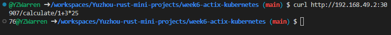

# Mini Project week6: Containerized Actix Calculator microservice deployed on Kubernetes
Deployed on: https://eeixxfhm34.us-east-1.awsapprunner.com/

Usage: https://eeixxfhm34.us-east-1.awsapprunner.com/calculate/1+(2*3)

## Containerization
1. In [lib.rs](https://github.com/nogibjj/Yuzhou-rust-mini-projects/blob/main/week4-actix/src/lib.rs), implement calculator logics 
2. In [main.rs](https://github.com/nogibjj/Yuzhou-rust-mini-projects/blob/main/week4-actix/src/main.rs), implement APIs with actix_web
3. In [Dockerfile](https://github.com/nogibjj/Yuzhou-rust-mini-projects/blob/main/week4-actix/Dockerfile), configure containerization
4. Build docker with ` docker build -t calculator .`
5. Test docker containerized app with `docker run -p 8080:8080 calculator`

## Deployment on Kubernetes


0. Prerequisite: make sure you have `docker`, `minikube` installed in machine

    To build codespace with `docker` and `minikube`: go to .devcontainer/devcontainer.json, add following text: 

    ``` 
    "features": {
		"ghcr.io/devcontainers/features/kubectl-helm-minikube:1": {},
		"ghcr.io/devcontainers/features/docker-in-docker:2": {}
	},
    ```
    
    And start a new codespace with .devcontainer/devcontainer.json as config file
1.  Push container to DockerHub (Optional): i.e. 

`docker login -u "myusername" -p "mypassword" docker.io` to login if haven't logged in in terminal

If haven't build image, build with tag: `docker build -t <hub-user>/<repo-name>[:<tag>]` i.e. `docker build -t yzwarren/rust-kube:latest`

If already built, tag with: `docker tag <already-built-image> <hub-user>/<repo-name>[:<tag>]` i.e. `docker tag calculator yzwarren/rust-kube:latest`

If `docker push <hub-user>/<repo-name>:<tag>`

Example of a pushed FastAPI container here:  https://hub.docker.com/repository/docker/yzwarren/rust-kube

2. `minikube start`
3. `minikube dashboard --url`
4. Hover over link and "follow link"
5. Create a deployment: `kubectl create deployment hello-actix --image=registry.hub.docker.com/yzwarren/rust-kube`
6. View deployment: `kubectl get deployments`
7. Create service and expose it: `kubectl expose deployment hello-actix --type=LoadBalancer --port=8080`
8. View services:  `kubectl get service hello-actix`
9.  `minikube service hello-actix --url`. This will show the url link to the webservice: i.e. http://192.168.49.2:30907
10. Curl web service using the above url: i.e. `curl http://192.168.49.2:30907`
11.  Use the calculator: `curl http://192.168.49.2:30907/calculate/1+3*25`. Result: `76`
12. Cleanup
```bash
kubectl delete service hello-actix
kubectl delete deployment hello-actix
minikube stop
````

## References
* [rust-cli-template](https://github.com/kbknapp/rust-cli-template)
* [rust-bert-translate](https://docs.rs/rust-bert/latest/rust_bert/index.html)
* [coursera-applied-de-kubernetes-lab](https://github.com/nogibjj/coursera-applied-de-kubernetes-lab)
