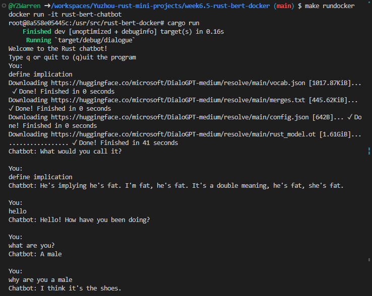

# Mini Project week6: rust-bert based chatbot running inside docker



## 1. Build project

`cd week6-rust-bert-docker`

`make build` to build docker

`make rundocker` to run the docker


`# cargo run` to start the chatbot

Follow the prompt for conversation

Example conversation

```
You: 
Define implication
        text: Define implication
Chatbot: When an event happens that makes you think that you can use it to persuade someone. That's an implication.
```
